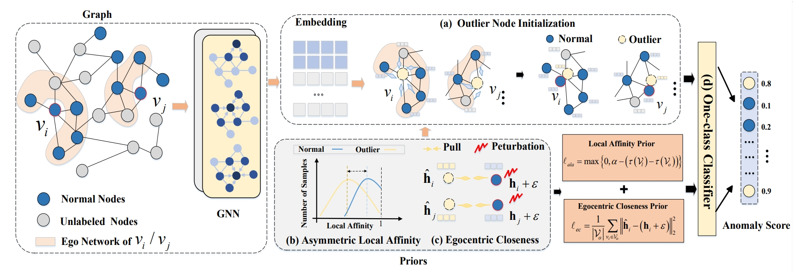

>📋  A template README.md for code accompanying a Machine Learning paper

This repository is the official implementation of NeurIPS'24 paper "Generative Semi-supervised Graph Anomaly Detection"
-
The full paper can be found at NeurIPS [Portal](https://neurips.cc/virtual/2024/poster/92932) or [arXiv](https://arxiv.org/abs/2402.11887).

[//]: # ( Optional: include a graphic explaining your approach/main result, bibtex entry, link to demos, blog posts and tutorials)
>📋  This work considers a practical semi-supervised graph anomaly detection (GAD) scenario, where part of the nodes in a graph are known to be normal, contrasting to the extensively explored unsupervised setting with a fully unlabeled graph. We reveal that having access to the normal nodes, even just a small percentage of normal nodes, helps enhance the detection performance of existing unsupervised GAD methods when they are adapted to the semi-supervised setting. However, their utilization of these normal nodes is limited. In this paper, we propose a novel Generative GAD approach (namely GGAD) for the semi-supervised scenario to better exploit the normal nodes. The key idea is to generate pseudo anomaly nodes, referred to as 'outlier nodes', for providing effective negative node samples in training a discriminative one-class classifier. The main challenge here lies in the lack of ground truth information about real anomaly nodes. To address this challenge, GGAD is designed to leverage two important priors about the anomaly nodes -- asymmetric local affinity and egocentric closeness -- to generate reliable outlier nodes that assimilate anomaly nodes in both graph structure and feature representations. Comprehensive experiments on six real-world GAD datasets are performed to establish a benchmark for semi-supervised GAD and show that GGAD substantially outperforms state-of-the-art unsupervised and semi-supervised GAD methods with varying numbers of training normal nodes.


## Requirements

To install requirements:

```setup
pip install -r requirements.txt
```

[//]: # (Describe how to set up the environment, e.g. pip/conda/docker commands, download datasets, etc...)
>📋
GGAD is implemented in Pytorch 1.6.0 with Python 3.7. and all the experiments are run on a 24-core CPU.


## Training 

To run the all the model(s) in the paper, run this command:

python run/dominant/anomalyDAE/ocgnn/aegis/gaan/tam.py


 To effectively incorporate the normal information into these unsupervised methods, for the reconstruction models, DOMINANT and AnomalyDAE, the data reconstruction is performed on the labeled normal nodes only during training. In OCGNN, the one-class center is optimized based on the labeled normal nodes exclusively. In TAM, we train the model by maximizing the affinity on the normal nodes only. As for AEGIS and GAAN, the normal nodes combined with their generated outliers are used to train an adversarial classifier.

The affinity margin α is set to 0.7 across all datasets. The perturbation in Eq. (5) is drawn from a Gaussian distribution, with mean and standard variance set to 0.02 and
0.01 for small datasets including Photo and Reddit. The mean and standard variance are set to 0 and 0 for other larger datasets. The size of the generated outlier nodes S is set to 5% for Amazon and 15% for other datasets based on loss convergence.


## Training on DGraph 

To run all the models on the DGraph, 

python src/main.py  
python src/graphsage_dominant.py  
python src/graphsage_anomalydae.py
python src/graphsage_aegis.py

All the competing methods are adapted to mini-batch training and semi-supervised setting.

## Datasets
For convenience, some datasets can be obtained from [google drive link](https://drive.google.com/drive/folders/1rEKW5JLdB1VGwyJefAD8ppXYDAXc5FFj?usp=sharing.). 
We sincerely thank the researchers for providing these datasets.
Due to the Copyright of DGraph-Fin, you need to download from [DGraph-Fin](https://dgraph.xinye.com/introduction).

| Dataset | Type | Nodes| Edges      | Attributes         | Anomalies(Rate) |
|--------|-------------|----------|----------------|----------|----------|
|Amazon |Co-review |11,944 |4,398,392| 25| 821(6.9%)|
|T-Finance| Transaction| 39,357 2|1,222,543 |10 |1,803(4.6%)|
|Reddit| Social Media |10,984| 168,016 |64| 366(3.3%)|
|Elliptic| Bitcoin Transaction| 46,564 |73,248| 93 |4,545(9.8%)|
|Photo| Co-purchase| 7,535| 119,043| 745| 698(9.2%)|
|DGraph| Financial Networks| 3,700,550 |73,105,508| 17 |15,509(1.3%)|

>📋  Pick a licence and describe how to contribute to your code repository. 

If you use this package and find it useful, please cite our paper using the following BibTeX. Thanks! :)

```bibtex
@inproceedings{qiao2024generative,
  title={Generative Semi-supervised Graph Anomaly Detection},
  author={Qiao, Hezhe and Wen, Qingsong and Li, Xiaoli and Lim, Ee-Peng and Pang, Guansong},
  booktitle={Advances in Neural Information Processing Systems},
  year={2024}
}
```

## Acknowledgement and Reference
[1] Liu, Kay, et al. "Pygod: A python library for graph outlier detection." arXiv preprint arXiv:2204.12095 (2022).  \
[2] Tang, Jianheng, et al. "GADBench: Revisiting and Benchmarking Supervised Graph Anomaly Detection." arXiv preprint arXiv:2306.12251 (2023). \
[3]Liu, Kay, et al. "Bond: Benchmarking unsupervised outlier node detection on static attributed graphs." Advances in Neural Information Processing Systems 35 (2022): 27021-27035. \
[4] Huang, Xuanwen, et al. "Dgraph: A large-scale financial dataset for graph anomaly detection." Advances in Neural Information Processing Systems 35 (2022): 22765-22777.
